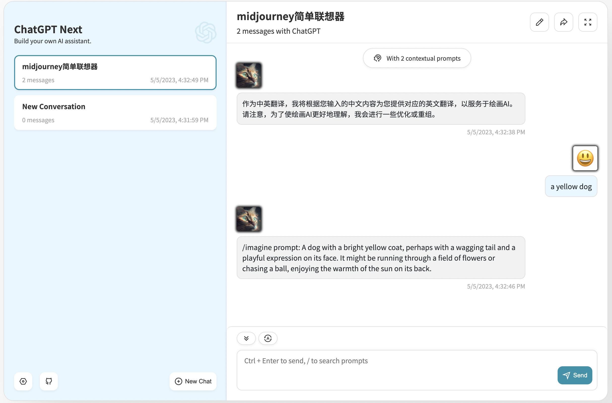
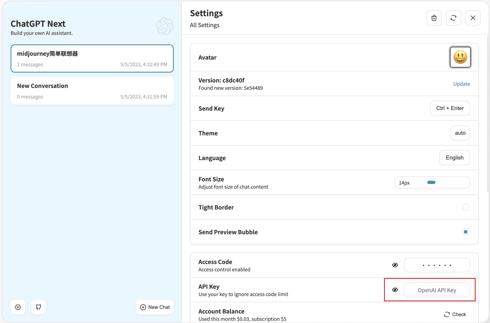

# ChatGPT-Persona

在[Yidadaa/ChatGPT-Next-Web](https://github.com/Yidadaa/ChatGPT-Next-Web)的基础上进行二次开发。主要新增了预置prompt生成特定角色的功能，以娱乐为主，大家感兴趣也可以自己部署上来玩玩。

这是一个娱乐项目，本质上只是添加了预置的prompt，但是加上了一个选角色的页面，再加上角色的介绍包装一下，就显得戏剧又好玩。🌝

🤩🤩🤩

如果遇到相关问题或是有更多新想法的欢迎创建issue讨论。


## API说明
本项目的API已经更换为[transitive-bullshit/chatgpt-api](https://github.com/transitive-bullshit/chatgpt-api)。
支持两种API模型：
#### ①ChatGPTAPI
调用openAI提供的API
(gpt-3.5-turbo,gpt-3.5-turbo-0301,gpt-4...)
#### ②ChatGPTUnofficialProxyAPI
使用网页accessToken，通过反向代理，间接调用chatGPT, 与在chatGPT网站上进行对话一样。
| Method                      | Free?       | Robust? | Quality?                        |  
| --------------------------- | ---------- | ---------- | ------------------------------- |
| `ChatGPTAPI`                | ❌ No  | ✅ Yes  | ✅️ Real ChatGPT models + GPT-4。[model-endpoint-compatibility](https://platform.openai.com/docs/models/model-endpoint-compatibility) |
| `ChatGPTUnofficialProxyAPI` | ✅ Yes | ❌ No️  | ✅ ChatGPT webapp        

这意味着🤠

1、（推荐）使用[OpenAI API key](https://platform.openai.com/overview)调用OpenAI API，快速且安全。
2. 可以使用网页accessToken，免费调用chatGPT API，前提是你已经注册了chatGPT账号。accessToken可以通过此[接口](https://chat.openai.com/api/auth/session)获取，也自行登录chatGPT官方网页，发送对话，使用开发者工具查看网络请求中使用的Bearer Toekn，Bearer后面的那一串就是accessToken。

警告：方式2使用accessToken虽然免费但不够稳定，而且需要使用反向代理。可以自建代理或使用的是公共的[社区代理](https://github.com/transitive-bullshit/chatgpt-api#reverse-proxy)，使用公共代理时，需要注意accessToken会暴露给第三方代理，需要自行考虑风险。

[社区代理](https://github.com/transitive-bullshit/chatgpt-api#reverse-proxy)目前https://ai.fakeopen.com/api/conversation,仍然可用，但不确定一直可以稳定使用。

## 🐣 Demo


## 🍄 Screenshots




## 🔥 快速体验

1.  [访问demo](https://meahabgpt.up.railway.app/)

2. 填入[OpenAI API key](https://platform.openai.com/overview)


3. 开始体验

## 🥃 部署

支持一键部署

1、vercel

[](https://vercel.com/new/import?s=https%3A%2F%2Fgithub.com%2Fjuaneboosham%2FChatGPT-Persona&project-name=ChatGPT-Persona&env=OPENAI_API_KEY&env=CODE&framework=nextjs)


2、Railway

[](https://railway.app/template/pPchvD?referralCode=5mcmNY)

vercel，railway分配的域名部分情况下会有DNS污染，可以在部署后绑定自定义域名。

## 🫐 部署环境变量设置


✍️ `OPENAI_API_KEY`（required）

openai官网生成的[OpenAI API key](https://platform.openai.com/overview)，需要有chatGPT账号并需要能够顺利登录。


✍️ `CODE`（optional）

可以理解为访问密码。建议添加。
如果部署到公网，应该限制访问，否则账号余额恐怕要给刷光。

✍️ `BASE_URL`（optional）

说明：OpenAI 接口代理 URL，如果你手动配置了 openai 接口代理，请填写此选项。
如果遇到 ssl 证书问题，请将 BASE_URL 的协议设置为 http。

> Default: https://api.openai.com

> Examples: http://your-openai-proxy.com

✍️ `OPENAI_ORG_ID`（optional）

指定 OpenAI 中的组织 ID。


✍️ `OPENAI_ACCESS_TOKEN`(optional)

需要与API_REVERSE_PROXY配合使用，当OPENAI_API_KEY存在时，OPENAI_API_KEY优先

通过access token的方式调用chatGPT的接口

✍️ `API_REVERSE_PROXY`(optional)

需要与OPENAI_ACCESS_TOKEN配合使用，如https://ai.fakeopen.com/api/conversation


## 🧊 本地开发

1.node环境, >= 16。

2.git clone

3.在.env.local文件下填入OPENAI_API_KEY

4.执行yarn install && yarn dev。


## 🐕🐖🐿 自定义角色

在项目的src/public/personas.json存储着角色的画像，预置prompt，及打招呼信息。（打招呼信息及画像设置json格式也都是AI生成的，hhh）

大家可以自行添加角色。

画像的图片目前存储在vercel部署的图床上，大家也可以自行更换图片（本地图片或其他图片来源）。

注意：next在获取外链图片时，需要在next.config.js添加hostname
```
  images: {
    remotePatterns: [
      {
        protocol: 'https',
        hostname: "image-bed.vercel.app",
        port: '',
        pathname: '/chatGPT/**',
      },
    ],
  },
  ```

## 🥰 鸣谢

感谢[Yidadaa](https://github.com/Yidadaa)，感谢[Yidadaa/ChatGPT-Next-Web](https://github.com/Yidadaa/ChatGPT-Next-Web)的参与者。


## 🤩 反馈
[Issues](https://github.com/juaneboosham/ChatGPT-Persona/issues)
